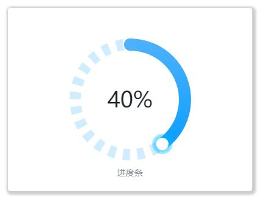

# @vue-chart/create-process-serie

[](https://www.npmjs.com/package/@vue-chart/create-process-serie)
[](https://www.npmjs.com/package/@vue-chart/create-process-serie)
[](https://github.com/halo951/vue-chart/tree/master/packages/create-process-serie)

## About

> Tips: 建议使用 `@vue-chart/echart` 作为图表组件, 也可以搭配其他图表组件使用

创建圆环进度图 (custom serie)



## Install

```bash

yarn add @vue-chart/create-process-serie

```

## usage

-   use in composition api

```vue
<script lang="ts" setup>
import { ref } from 'vue'
import createProcessSerie from '@vue-chart/create-process-serie'
import type { EChartsOption } from '@vue-chart/echart' // or from 'echart'

const options: EChartsOption = createProcessSerie(/* data source */)

const chartOptions: Ref<EChartsOption> = ref(options)
</script>
```

-   use in class api

```vue
<script lang="ts" setup>
import { Component, Vue } from 'vue-property-decorator'
import createProcessSerie from '@vue-chart/create-process-serie'
import type { EChartsOption } from '@vue-chart/echart' // or from 'echart'

@Component({})
export default class extends Vue {
    options: EChartsOption = createProcessSerie(/* data source */)
}
</script>
```

-   use in js

```vue
<script lang="ts" setup>
import createProcessSerie from '@vue-chart/create-process-serie'

export default {
    data() {
        return {
            options: createProcessSerie(/* data source */)
        }
    }
}
</script>
```
